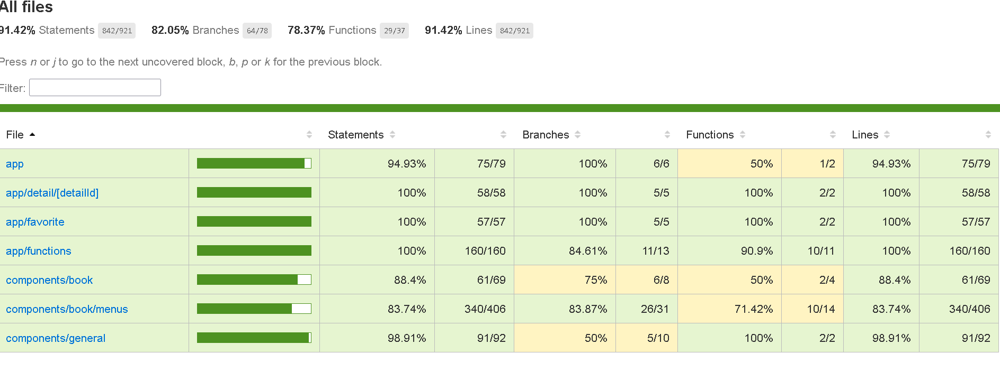

**Due Date: 3 Days**

### Test Case

#### Pages
##### Book List Page
1. Frontend Framework: Use Next.js for building the frontend. [DONE]
2. API Integra1on: Fetch book data from the Google Books API or any similar public API. [DONE]
3. Search Func1onality: Implement a search bar allowing users to search for books by 2tle, [DONE]
author, or any other relevant criteria.
4. Book Listing: Display search results or all available books in a grid or list view. [DONE]
5. Book Details: When a user clicks on a book, show detailed informa2on about the book [DONE]
including its 2tle, author, descrip2on, and any other relevant data.
6. Favourites: Allow users to add books to their favourites list. This list should persist even  [DONE]
aSer the user refreshes the page.
7. Responsive Design: Ensure the applica2on is fully responsive and works well on both  [DONE]
desktop and mobile devices.
8. Error Handling: Implement proper error handling for cases like failed API requests or 
invalid search queries. [TBD]
9. Loading States: Display loading indicators or placeholders while fetching data from the  [DONE]
API.
10. Unit Tes1ng: Write unit tests for cri2cal components and func2onali2es using a tes2ng [DONE]
library like Jest or React Tes2ng Library.

 ### Unit Tests
 


## Getting Started
install latest nodejs version


install package
```bash
npm install
# or
yarn
```


First, run the development server:

```bash
npm run dev
# or
yarn dev
```

Open [http://localhost:3000](http://localhost:3000) with your browser to see the result.

You can start editing the page by modifying `pages/index.tsx`. The page auto-updates as you edit the file.

[API routes](https://nextjs.org/docs/api-routes/introduction) can be accessed on [http://localhost:3000/api/hello](http://localhost:3000/api/hello). This endpoint can be edited in `pages/api/hello.ts`.

The `pages/api` directory is mapped to `/api/*`. Files in this directory are treated as [API routes](https://nextjs.org/docs/api-routes/introduction) instead of React pages.

## Learn More

To learn more about Next.js, take a look at the following resources:

- [Next.js Documentation](https://nextjs.org/docs) - learn about Next.js features and API.
- [Learn Next.js](https://nextjs.org/learn) - an interactive Next.js tutorial.

You can check out [the Next.js GitHub repository](https://github.com/vercel/next.js/) - your feedback and contributions are welcome!

